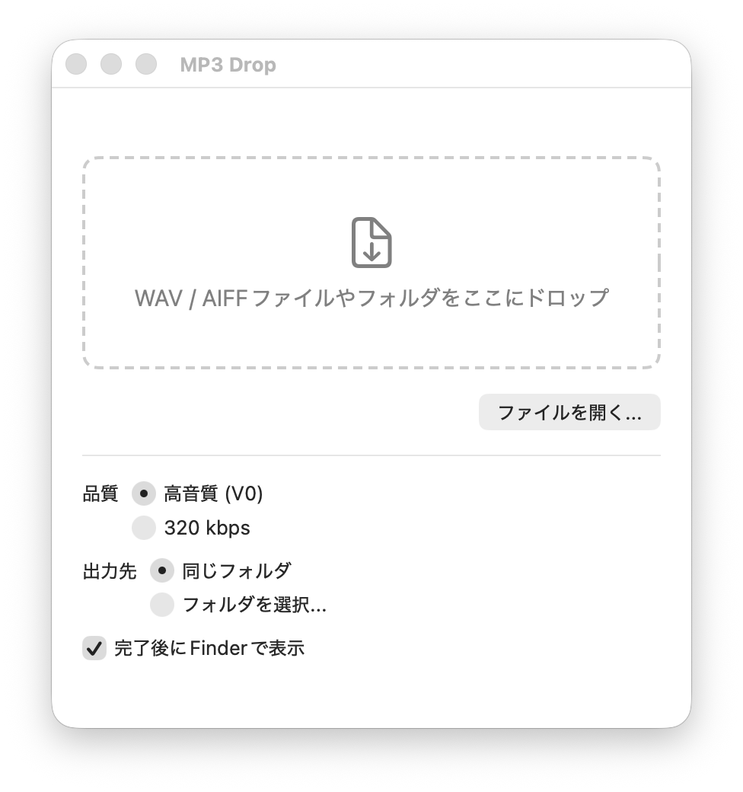
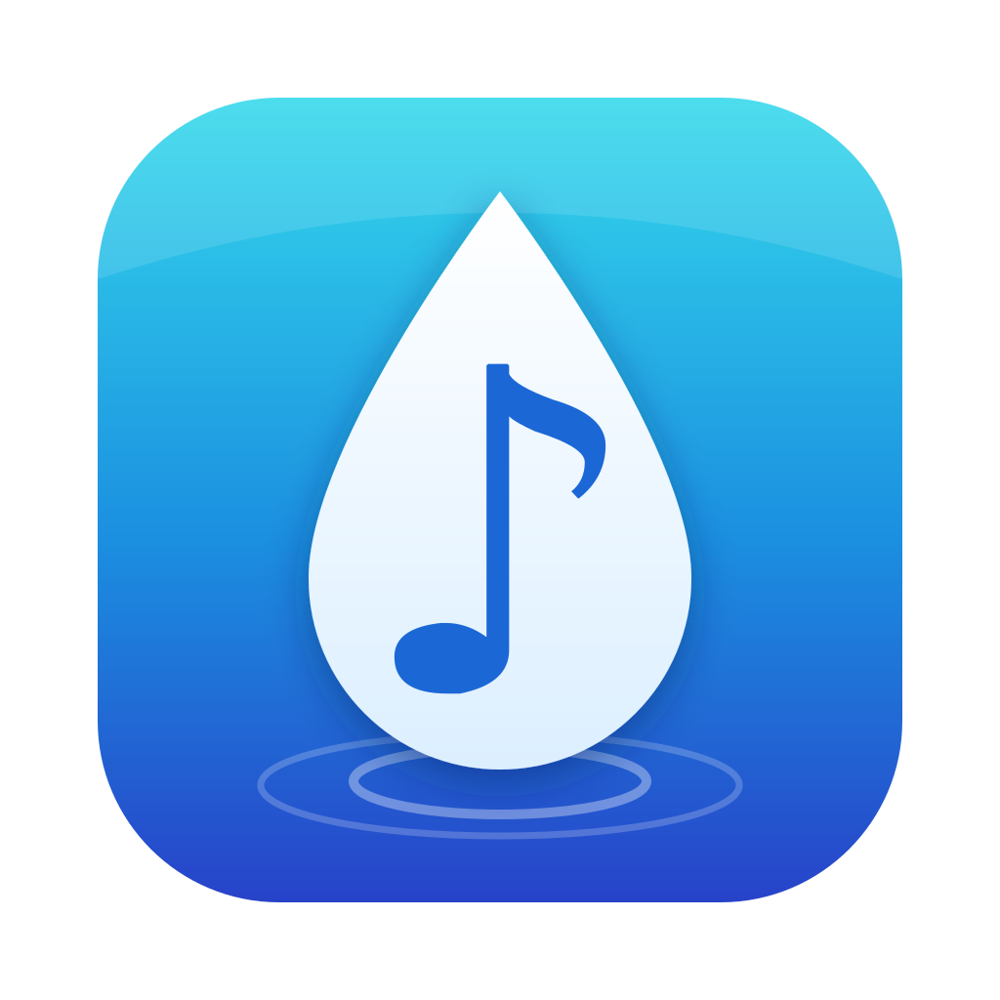

# MP3 Drop

WAV / AIFF / FLAC ファイルをドラッグ&ドロップするだけで MP3 に変換する macOS アプリです。





## 対応フォーマット

- 入力: WAV / AIFF / AIFC / FLAC(フォルダをドロップすると中の対応ファイルを再帰的に変換)
- 出力: MP3(LAME エンコーダ使用)

## 主な機能

- **ドラッグ&ドロップ変換** — ファイルやフォルダをウィンドウに落とすだけ。複数ファイル・フォルダ混在もOK。
- **品質プリセット** — 「High Quality (V0)」(LAME V0 可変ビットレート)と「320 kbps」(最大固定ビットレート)の2種類。
- **出力先の選択** — 元ファイルと同じフォルダ、または任意のフォルダに保存。
- **上書き確認** — 同名の MP3 がある場合は「置き換え / 両方残す / スキップ」を選択可能。
- **変換後のアクション** — Finder で表示、通知音の再生(設定でオン/オフ)。
- **日本語 / 英語対応**

## 動作環境

- macOS 14 以降

## インストール(ダウンロードして使う)

プログラミングの知識は不要です。

1. [Releases ページ](https://github.com/cheebow/mp3drop/releases/latest)を開き、`MP3Drop-x.y.zip` をダウンロードします。
2. ダウンロードした zip をダブルクリックして解凍し、出てきた `MP3Drop.app` を「アプリケーション」フォルダに移動します。
3. `MP3Drop.app` をダブルクリックして起動します(Apple の公証済みなので、そのまま開けます)。

## 使い方

1. MP3 Drop を起動し、ウィンドウに WAV / AIFF / FLAC ファイル(またはフォルダ)をドラッグ&ドロップします。
2. 変換が自動で始まり、一覧に進捗が表示されます。
3. 変換された MP3 は元ファイルと同じフォルダ(または設定した出力先)に保存されます。

品質や出力先は「設定」(**⌘,**)で変更できます。

> アプリはサンドボックス化されているため、初回の保存時に出力先フォルダへのアクセス許可を求められます。ホームフォルダを一度許可すれば、その中のすべてのフォルダに書き込めるようになります。

## ビルド(開発者向け)

Xcode プロジェクトは [XcodeGen](https://github.com/yonaskolb/XcodeGen) で生成します。

```sh
brew install xcodegen
xcodegen generate
open MP3Drop.xcodeproj
```

LAME(`Frameworks/libmp3lame.xcframework`)はリポジトリにコミット済みです。再ビルドする場合は `Scripts/build_lame.sh` を実行してください(ソースは `Vendor/lame-3.100.tar.gz`)。

リリース(署名・公証・GitHub Release 作成)は `Scripts/release.sh` で行います。

## ライセンス

MIT License — 詳細は [LICENSE](LICENSE) を参照してください。

MP3 エンコードには [LAME](https://lame.sourceforge.io)(LGPL-2.0-or-later)を動的リンクで使用しています。詳細は [THIRD_PARTY_LICENSES.md](THIRD_PARTY_LICENSES.md) を参照してください。
